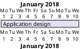
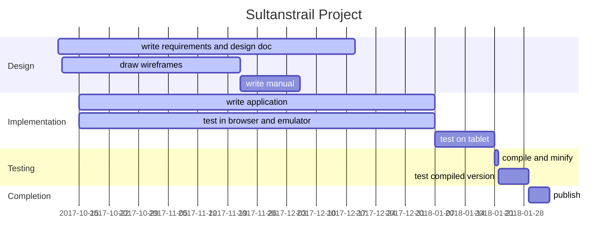

[toc]

# Planning and Progress Document

## Purpose of the document
Purpose of this document is to make a record of requirements and to show which of the requirements are implemented, which are not implemented yet or even not feasible.

Communication will be done by sending this document to the contacts after which there will be some comments, additions, changes or removals. This will be visible later in this document in the design and planning.

# Requirements

## Purpose of the application

The application helps the user to find his/her way on a trail called the Sufi trail. This is a route between Istanbul to Konya. The GPS on the devices is used to show the location of the user.

### What the application must do

### Where the Application must run
* [x] Cordova. Is needed to embed the App written in HTML and JavaScript in such a way that it can use the SDK of Android/IOS/Windows to access the device.
* [x] Android. This will be the first target.
  * Android SDK. This piece of software and toolbox is needed between the App and the device.
* [ ] IOS.
* [ ] Windows.
* [x] Linux on the desktop computer. This is necessary to develop the application.

### On what devices must the application run
* [ ] Tablets of several sizes.
* [ ] Mobile phones of several sizes.

### Events to listen to
There are several events which occur upon changing conditions in a device. These events must be captured for further actions.
* [ ] Battery conditions:
  * Warn user of battery low state. Can dim display or other options to save energy.
* [ ] Gps information.
  * Show current location
  * Record track of user
* [ ] Network on and off line mode. When on then
  * It is possible to update maps
  * Send out walked tracks
* [x] Device orientation. To show map correctly pointing the map-north to the real north.
* [x] Resize events to change from portrait to landscape mode and back.
* [ ] Camera.
  * To add the picture as a point on the map when saved.
* [ ] Time and clock.
  * Show date and time.

# The pages of the application
A series of screen descriptions the application can show.

## Splash screen
A splash screen is always nice to display information in such a way that it makes a connection between the hiking and biking literature published by the Sufi trail group. The other purpose is that the application can start in the background and when it is ready, the splash screen is removed.

  * [ ] Show a screen with a Sufitrail icon. Keep this displayed until everything is initialized.

## Start page
The start page is the home page named **Map** below in the list of menu entries. On this page the following is shown;

  * Map. The map is displayed over the full width and height of the device.
    * [x] Map displayed, move around with swipe.
    * [x] Map should fill page automatically.
    * [x] Map, Menu and buttons must be adjusted when device is rotated.
    * [ ] Show features for starting scale of map.
  * Zoom buttons. The buttons are placed on the left side.
    * [x] zooming with buttons.
    * [x] zooming by pinching (on mobile device).
    * [ ] Reveal more features when zooming in.
    * [ ] Remove features when zooming out.
  * North arrow button on the top right side.
    * [x] Click action aligns map to the north.
  * Open menu button ☰. Button is placed just below the north arrow.
    * [x] Click action shows the menu on the right side of the page.
  * Open street map attribute on the bottom right of the map.
    * [x] OSM attribution is displayed.

### When track is shown
  * [ ] Show current location using GPS.
  * [ ] Show dashed line from current location to closest point on the trail when off trail (further than, lets say, 1 kilometer).

### The Menu
Pressing the menu button ☰ shown on the map, will open a pane from the side to show a menu of options. A click on an entry will show a page. Each page may have a shortcut to the home page: **Map** next to a menu button. When selecting an entry, the menu is closed and a page will appear.

  * [x] **Map**: Show map, explained above
  * [ ] **Info**: Show route info
  * [ ] **Tracks**: Select a track
  * [ ] **Feature** Show history, or other info.
  * [ ] **Start**: Record your track data
  * [x] **About**: Show a page with version, people and contacts
  * [ ] **Exit**: Close the application

## The info page

## The Tracks page
  * [ ] Generate the page from the directory contents. This is usable later when several tracks for other walks are loaded. Also those made by the hiker can be placed there.
  * [x] Show map when a selection is made.
  * [x] The route is displayed
  * [x] The route is centered on page
  * [ ] The route is zoomed so as to fit the page.

## The Features page
 Is filled when feature is clicked. First a balloon is showed on the map pointing to the feature with text and a 'more ...' on the bottom.

## The Start page

## The About page
  * [x] Show the members of the Sufi trail group.
  * [x] Show current version of the program. Can be kept elsewhere, e.g. android manifest, and inserted here by using JavaScript.

## The Exit page
This should show a dialog to ask the user if he/she really wants to quit the program.
  * [ ] Show quit dialog
  * [ ] When really exiting, a recorded track must be saved.

# Items or problems to think about
  * [ ] Color mapping must match that of the maps printed on paper.
  * [ ] Add ability to choose other color maps for visual impaired or color blind people.
  * [ ] By what license should the project be protected
  * [ ] When clicking on a feature on the map, does the information show in a balloon or on a new page. Feature information;
    * [ ] Restaurant - reservation information and facility
    * [ ] Hotel etc - booking information and facility
    * [ ] Mosque - historic background
    * [ ] City, village - historic background, city elders contact info, etc.
  * When online
    * [ ] When confirmed, refresh maps in cache
    * [ ] Try to get weather forecast and cache this information too
  * Cache. Several forms of caching are possible.
    * [ ] The program needs to keep a cache for map tiles.
    * [ ] There might be a cache used internally by Android/IOS/Windows to store external JavaScript files and style sheets. This is useful to keep the libraries up to date automatically.

# Track data
The app uses gpx data to read track information, show it and focus on it when first loaded. These gpx files must be edited (by a separate program) to add some data in the metadata section and extensions section of the gpx file.
* [x] Program to make the calculations and store in gpx file: `gpx-edit.pl6`.
  * [x] Calculate minimum and maximum of longitude and latitude so the app doesn't have to do it.
  * [x] Calculate the center of the track for the same reason.
  * [x] metadata
    * [x] name; filename without '.gpx' and punctuation replaced by spaces.
    * [x] desc; "hiking routes from Vienna to Istanbul".
    * [x] author; "Sultanstrail".
    * [x] copyright; "Sultanstrail".
    * [x] link; "http://www.sultanstrail.com/".
    * [x] time; date and time of conversion.
    * [x] keywords; "hike", "Vienna", "Istanbul" and some others taken from the filename.
    * [ ] bounds; not used
    * [ ] extensions; not used

* [x] Remove all spaces between elements thereby making the gpx file smaller.
* [x] Program to convert all tracks using above program: `convert-all-tracks.pl6`.
  * [x] Convert tracks one by one.
  * [ ] Compress the track to a smaller format to make the payload smaller.
* [ ] Start showing the sultanstrail icon and only show content when everything is ready in the background. This provides a better user experience.

# Bugs
* [ ] Android. Hangup after a while when swiping etc. over the map
* [ ] Gpx files are missing a proper xml prefix after conversion

<!--
# Planning

-->

<!--

-->

# Contacts from Sultanstrail

|Name|Email|Notes|
|----|-----|-----|
| Sedat Çakir | sufitrail@gmail.com | Project leader
| Iris Bezuijen | sufitrail@gmail.com | Web master
| Rob Polko | rob@sultanstrail.nl | Map design
| Tine Lambers | | Office Manager
| Merel van Essen | | Writer of handbook
| Pijke Wees | pijkev@hotmail.com | Cartographer
| Marcel Timmerman | mt1957@gmail.com | Application builder
